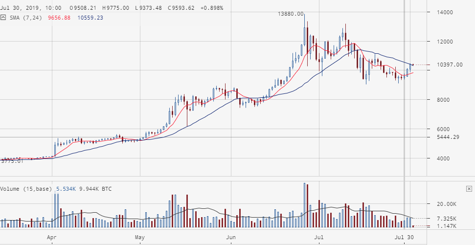
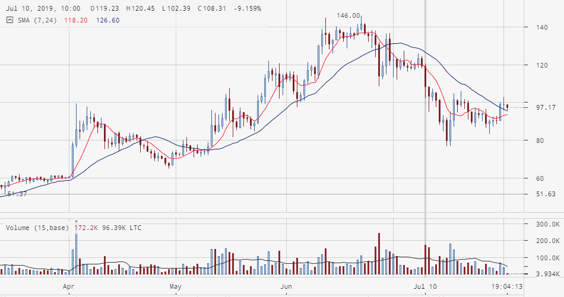
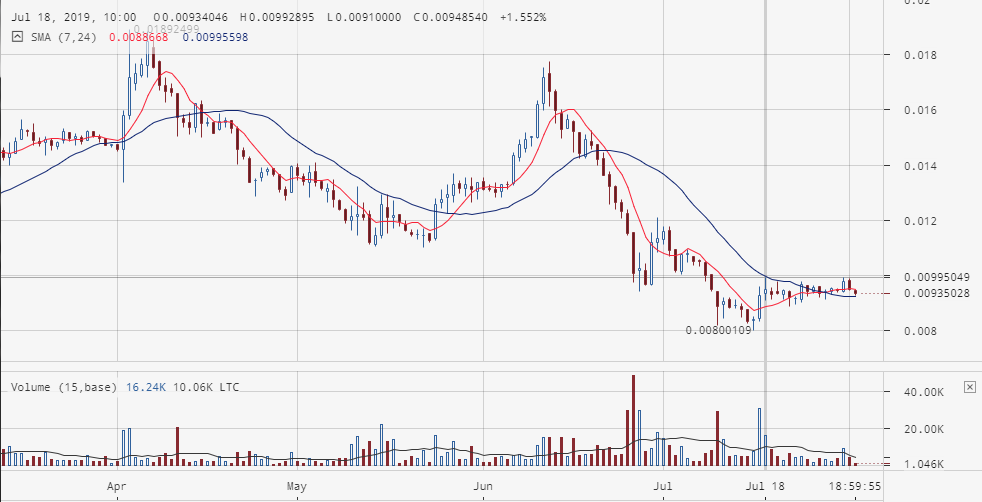

# 02.08.2019

## Разбор полётов
[Вчера](2019.08.01.md) был запущен каскад LTC/BTС для биржы EXMO с отключенным автоповтором, чтобы убедится в адекватности расчёта профита.  
Сумма должна быть следующая: 0.04433 + профит + 0.009962.  
Вчера в 22:27 был получен профит 1.23E-5 btc, что в итоге должно составить 0.0543043 btc. На балансе у нас 0.05430971. В значащих цифрах всё сходится, есть некое превышение баланса. Типа запас.  
Устанавливаю объём инвестиций в бот 0.0543 btc и запускаю его.

### Следующая проблема
В 00:11 пришло сообщение об ошибке: "Quantity by order is less than permissible minimum for this pair". Суть проблемы в том, что объем профитного ордера оказался меньше дозволенного биржей.  
Биржа EXMO, пара BTC/RUR. Инвестиционный ордер - buy amount: 0.00010004, buy price: 644438.64560219. Профитный ордер - sell price: 654135.79761782, sell amount: 9.984E-5.  
Что интересно, аналогичная проблема, с точно такой-же суммой возникла у другого клиента биржы.

На моём каскаде произошло выполнение следующих инвестиционных ордеров, поэтому проблемный профитный ордер стал не актуален. К сожалению, у клиента исполнен всего один инвестиционный ордрер и поступить аналогичным образом я не могу.  
Сейчас запущу свой восстановленный каскад, если не будет ошибки подшаманю сумму клиента и буду делать проверку объёма инвестиционных ордеров или добавлю мелкую константу-костыль для формирования нормального инвестиционного ордера и, как следствие, нормального профитного ордера.

Бот запустился. Исправляю косяк у клиента и вставляю проверку профитных ордеров. В случае возникновения неисполняемого профитного ордера отправляю каскад в перезагрузку.

Засада. У клиента происходит перерасчёт профитного ордера. И он пять урезает его объём. Нашёл проблемный ордер и вручную прописал его объём. Костыль, конечно, но по крайней мере каскад живой.

## Ревизия каскада BTC/RUR на YoBit
Баланс каскада 9656.077 rur, баланс биржы Баланс:9657.84 - всё ок.  
Включил автоповтор и запустил бота.

## Изменения в коде
Ставлю проверку профитных ордеров на минимальный объём ордера.  
Добавил проверку в Speculator_Bots_Cascade_Engine->getProfitOrders. Здесь, в случае создания профитного ордера с amunt меньше, чем прописано в настройках торговой пары min_amount, вместо массива ордеров возвращается false.  
Также выполняю проверку полученного профитного каскада в Speculator_Bots_Cascade_Engine->createCascade. В случае ошибки выводится оповещение. Оно будет прихоить мне на мыло.  
По идее, после получения нескольких пустых каскадов, при изменении рынка, бот сформирует новый каскад удовлетворяющий условиям торгов. Я же буду отслеживать это через почту. Если число писем по одному каскаду будет не больше 5 - можно будет убрать оповещение.

С замиранием сердца заливаю изменения на бой.

## Состояние рынка
Смотрю рынок bitstamp'а на днявках.

По паре BTC/USD: 30.07 закончилась консолидация и с 1.08 рынок пошел вверх. Сегодня рынок упёрся в линию сопротивления.  

По паре LTC/USD ситуация аналогичная, но линия сопротивления пробита.  

Отношения этой крипты можно наблюдать на рынке LTC/BTC  

После затяжного падения рынок понемногу стал ползти вверх.

Возможно следующее развитие событий:  
BTC/USD не преодолеет линию сопротивления и дальше покатится вниз.  
LTC/USD бодет флетить и потихоньку, или резко, полезет вверх.  
Как следствие, возможно мы увидим ощутимый рост рынка LTC/BTC. Альтернативный прогноз - явное падение на рынках крипта/фиат и невнятный флет на рынке крипта/крипта.

Время актуальности прогноза - 5-7 дней.
