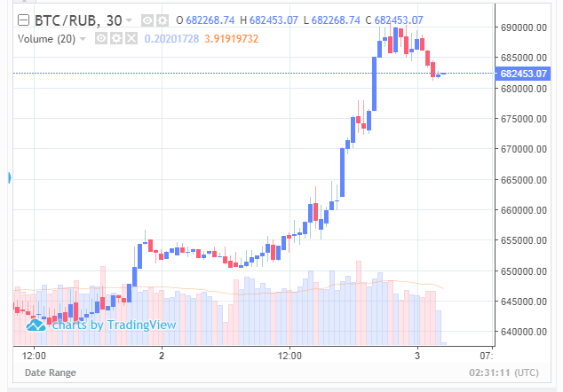

# 2019.09.03
## Ревизия
Три дня назад отключил автоповтор у всех ботов.  
Сегодня в 4:32 для YoBit и в 4:16 для exmo боты BTC/RUR вышли из сделки.
Смотрим балансы
### YoBit
|Бот        |Биржа   |
|-----------|--------|
|9'914.45	|9'919.31|
### Exmo
|Бот        |Биржа    |
|-----------|---------|
|16'602.85	|16'654.44|

Всё бъёт. Всё ок.
## Дальнейшие действия
Для YoBit BTC/RUR прописал инвестиции в 9'915, для exmo BTC/RUR - 16'640 р.

Сейчас 12:28 идёт коррекция после резкого взлёта, дождусь падения курса до 675'000 btc/rur на exmо и запущу ботов.  
Ну или возврата курса к 690'000 btc/rur, тогда тоже запущу.