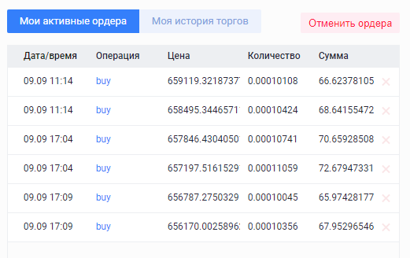

# 2019.09.10
## Выполнение каскадов
На бирже Yobit после долгого затишья (с 2019.8.14) был выполнен каскад LTC/BTC баланс каскада 0.03920744 btс, реальный баланс на бирже: 0.03924205 btc.  
Всё бъёт.

Меняю баланс бота на 0.03924 и меняю стартовый отступ с 0.2 на 0.15 сигмы.  
Запускаю.

Также на бирже EXMO исполнился аналогичный каскад (вошёл в сделку 2019.8.14).  
Финальный баланс бота 0.0552098 btc, баланс биржы 0.05469112 - **незачёт**. Возможно это сегодняшнее событие повлияло. Остановлю каскад BTC/RUR и проверю.

Запускаю бота с балансом 0.05469 btc и отступом 0.15
## Фиатные боты
В [воскресенье](2019.09.08.md) поменял стартовые отступы у ботов BTC/RUR на обоих биржах исходя из 1H графика.

Интересный момент. Каскад на бирже EXMO уже пару раз сработал, на бирже Yobit ещё не разу не вошёл в сделку.  
Меняю стартовый отступ для Yobit каскада BTC/RUR с 0.8 сигмы на 0.7.

Изменение значений стартовог отступа сделаю после выхода из клина.  

## Проишествие на EXMO
Сегодня, в 5:00 пришло два сообщения об ошибках на бирже EXMO в связи с выполняемыми работам.  
В 8:14 пришли сообщения о закрытии этих ошибок.  
Вроде всё норм.

При заходе на сайт биржы обнаружил следующую картину:  

На спекуляторе картина слудующая:
  
Список ордеров на спекуляторе показал аналогичную картину.

Т.е. только последние два ордера на бирже являются валидными. Похоже, что остальные образовались в результате суеты на бота при работах на бирже.  
Отменил первые 4 ордера.  
## Ревизия BTC/RUR на EXMO
Бот показывает баланс 16659.023 rur.  
Пока бот не вошёл в сделку, останавливаю его.

Баланс rur на бирже до отмены ордеров: 16820.79 + 133.92 = 16954.71  
Баланс rur на бирже после отмены ордеров: 16954.71

Разница в балансах: 16954.71 - 16659.02 = 295.69  
Вот куда утекли btc

Восстанавливаю работу каскада с балансом 16950 rur.  
Судя по всему были проданы btc на 295 rur
