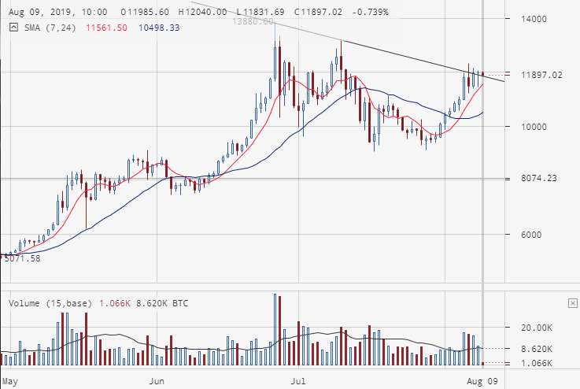
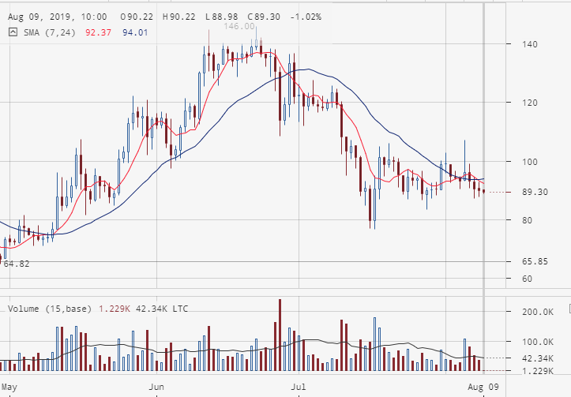
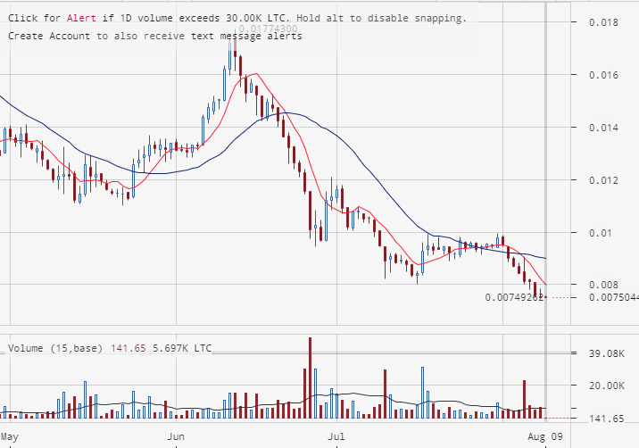

# 09.09.2019
Так ребятки, 7 дней назад был сделан прогноз по рынку, давайте разбирать что получилось и почему я предсказал фигню.

## Разбор предсказания
Напоминаю, что прогноз строится согласно **дневным** графикам биржы **BITSTAMP**.

[02.09.2019](2019.08.02.md) я предполагал следующее:  
*BTC/USD не преодолеет линию сопротивления и дальше покатится вниз.
LTC/USD бодет флетить и потихоньку, или резко, полезет вверх.
Как следствие, возможно мы увидим ощутимый рост рынка LTC/BTC. Альтернативный прогноз - явное падение на рынках крипта/фиат и невнятный флет на рынке крипта/крипта.*

*Время актуальности прогноза - 5-7 дней.*

Что мы имеем в результате на текущий момент.

BTC/USD дошёл до **реальной**, а не воображаемой линии сопротивления и топчется сейчас на ней.

LTC/USD сделал пару попытко проравть линию сопротивления, но не сумел и что он будет делать дальше, мне решительно непонятно. Возможно вообще устремится вниз, несмотря на уполовинивание.  

LTC/BTC после консолидации бодренько почапал вниз.  

## Выводы из неудавшегося прогноза
  - Линии поддержки и сопротивления нужно рисовать.
  - Пока, с моим опытом прогнозов, не стоит строить зависимости исходя из связанных графиков.

## Мой прогноз на следующую неделю
Что станет с BTC/USD будет известно спустя некоторое время. Пока цена крипты топчется на линии сопротивления. Нужно дождаться явного движения. Пока на этом рынке я бы не стал входить в сделку.  
~~когда суточная свеча своей ценой окажется выше уровня сопротивления, тогда цена btc продолжит падать, но не так люто.~~

LTC/USD явно вышел за линию сопротивления и сейчас колбасится в консолидации. Я бы вошёл в длинную сделку.

С LTC/BTC - тоже сейчас не могу проанализировать. Явный медвежий тренд, но видна тенденция к развороту.

В течении недели мы узнаем, кто главнее - генеральный тренд или линии поддержки и сопротивления.