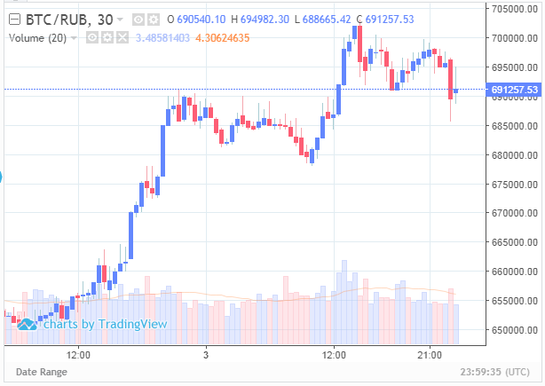
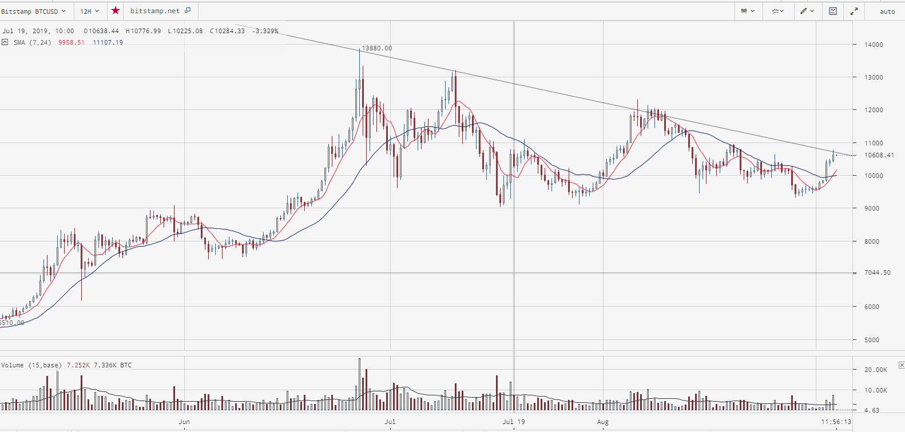

# 2019.09.04
## Запуск каскадов
Пока так и не решлися. Согласно [вчерашнему](2019.08.03.md) "решению", каскады я должен был запустить при выходе цены из диапазона 675'000 - 690'000 btc/rur.  
На моент моего пребывания в офисе, цена из этого диапазона не вышла. Дома было не до этого.

На текущий момент наблюдается следующая картина:


По идее, цена преодолела величину 690'000 btc/rur и пора запускать ботов. Но есть ещё один момент:


Это 12H грфик.  
Исходя из него ставлю новое условие запуска ботов: закрытие 12h свечи над линией сопротивления, либо снижение цены до 675'000 btc/rur на exmo, что равно 10'365 btc/usd на bitstamp'е.
## Тестирование торгов
Вручную выкачиваю данные о торгах
```
mysqldump -umorro_spec -p%password% --no-create-info --insert_ignore --extended-insert  --where "pair_id = 13" morro_spec s_trade_stats | gzip > trades_stat.zip
```