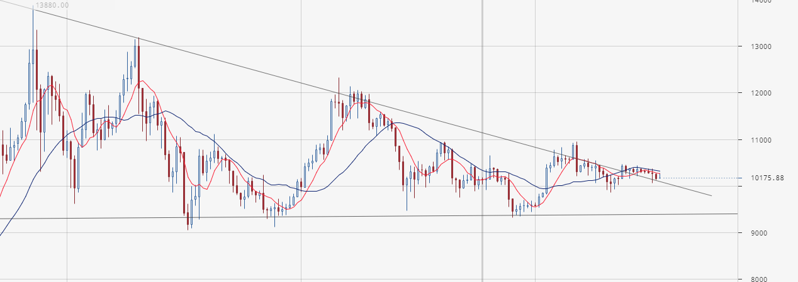
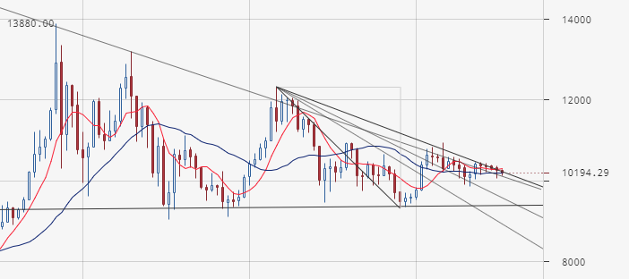

# 2019.09.18
## Состояние рынка btc/usd
[Более недели назад](2019.09.10.md) я ожидал выхода и треугольника. Либо растущий тренд, либо падающий.

Сейчас ситуация выглядит так:
  
Получилась старая биржевая шутка:  
```
- Куда идёт рынок, вниз или вверх?
- Рынок идёт вбок.
```

Рассмотрим ситуацию на дневном графике с линиями поддержки, или как там они назывались в учебнике по тех.анализу:  
  
Точки максимума и минимума выбирал так, чтобы линии максимально совпали с графиком торгов.

Глядя как этот график пробивает уровень за уровнем, можно предположить, что глобальный тренд для btc/usd меняется. По крайней мере, рынок перестанет быть медвежим.
## Выводы
Помня, что глобальный тренд зачастую главнее всех этих фигур, поступаем следующим образом:
 - Для каскада btc/rur на бирже Yobit меняем стартовый отступ с 0.7 на 0.4
 - Для каскада btc/rur на бирже exmo меняем стартовый отступ с 0.9 на 0.5
 - после демонстрации чистой 12h свечки, ставим стартовые отступы по умолчания
 - в случае дикой просадки, мы сами себе злостные буратины и при длительном сидении в сделке (свыше 14 дней), тоже ставим стартовые отступы по умлочанию