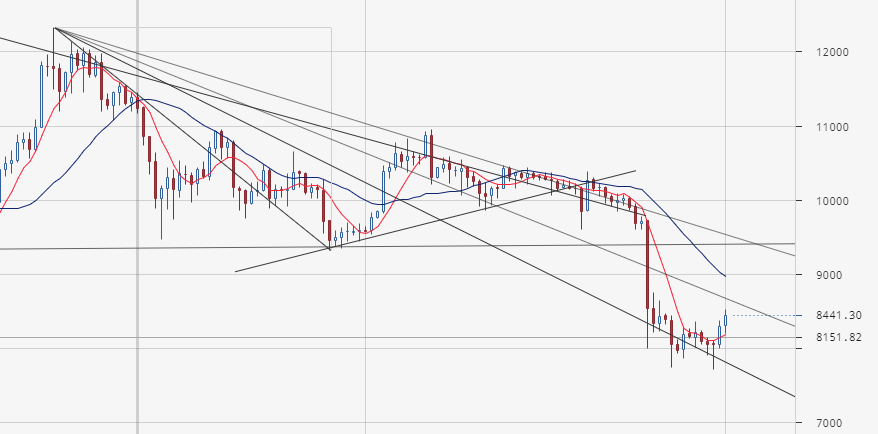

# 2019.10.01
## Состояние рынка btc/usd
[2019.09.18](2019.09.18.md) завершался треугольник. Глобальный тренд был на понижение. В ожидании падения увеличил стартовые отсупы. Сперва 0.7 - 0.9, затем пожадничал (**?**) и поставил отступы в 0.4 и 0.5 для YoBit и EXMO бирж соответственно.

Сейчас рынок выглядит так:  

Бот BTC/RUR на YoBit исполнился на 53/60.  
Бот BTC/RUR на EXMO исполнился на 96/102.

Согласно моему плану выставляю значения стартовых отступов в изначальные - 0.15.