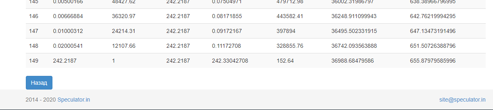
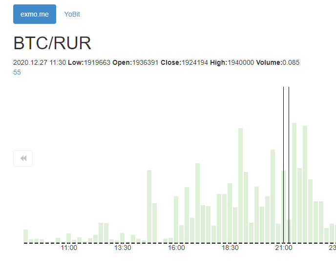
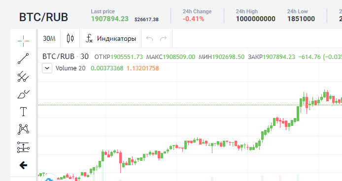

# 2020.12.28 Понедельник
## Exmo
Вчера штормило ботов, даже пришло сообщение: `pair: BTC/RUR 9.9852393799404E-5<0.0001`.

Затем, рассматривая ботов обнаружил следующий момент:  
  
Последний ордер имеет цену в 1 рубль за биткоин.

График в спекуляторе показывает следующую картину:  


Что забавно, на бирже в статистике отмечен этот момент, а вот на графике - никаких следов.


Похоже, что в связи с пустым стаканом случился всплеск. Сигма разрослась настолько, что цена последнего закупочного ордера достигла отрицательных величин.

У меня было подобный случай на паре ltc/btc с отрицательными ценами. На этот случай у меня стоит ограницение в минимально возможную цену. Надеюсь, что минимальная цена действительно берётся из настроек биржы.

Отключил автоповтор бота btc/rur на yobit. Т.к. похоже что тренд биткоина сменился на нисходящий.

Стоит ли почистить статистику?  
Возможно ситуция "ложной слепоты".

Начинаю чистить.

|Exch id|Exchange|
|:--:|:--|
|2|Exmo|
|3|YoBit|

exmo btc/rur pair_id = 11;

```SQL
SELECT 
    FROM_UNIXTIME(start_ts) as start_dt,
    FROM_UNIXTIME(end_ts) as end_dt,
    ts.*
FROM `s_trade_stats` as ts
WHERE `pair_id` = 11 and `start_ts` > unix_timestamp('2020-12-25') and price_max > 1e7;
```
Результат запроса.
```SQL
INSERT INTO `s_trade_stats` (`pair_id`, `start_ts`, `end_ts`, `cou`, `price_open`, `price_min`, `price_max`, `price_close`, `amount_sum`, `amount_2_sum`, `price_sum`, `price_2_sum`, `volume_sum`, `volume_2_sum`) 
VALUES 
    ('11', '1609067400', '1609067699', '19', '2000000.00000000', '2000000.00000000', '100000000.00000000', '2000000.00000000', '0.02409220', '0.00013439', '340000000.00000000', '30160000000000000.00000000', '67394.35975032', '697659598.99097000'), 
    ('11', '1609067700', '1609067999', '18', '2000000.00000000', '2000000.00000000', '100000000.00000000', '2000000.00000000', '0.02310151', '0.00015469', '134000000.00000000', '10068000000000000.00000000', '46351.00009364', '618796527.99926000'), 
    ('11', '1609068000', '1609068299', '39', '2000000.00000000', '2000000.00000000', '100000000.00000000', '2000000.00000000', '0.32276685', '0.02545320', '176000000.00000000', '10152000000000000.00000000', '646706.75410161', '101814223081.04000000')
```

Произвёл чистку запросом
```SQL
DELETE FROM `s_trade_stats`
WHERE `pair_id` = 11 and `start_ts` > unix_timestamp('2020-12-25') and price_max > 1e7;
```

Жду обновление кеша.