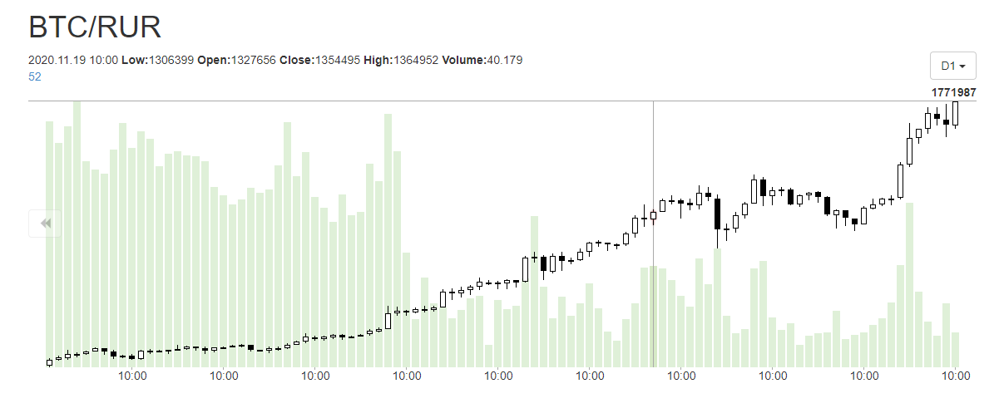

# 2020.12.23 Среда
## EXMO
Не помно когда, но я отключил автоповтор у бота btc/rur. Возможно это было во время моей паники вызванной жадностью связанной с большим объёмом на боте btc/rur yobit.

Суть паники была в том, что сейчас курс достиг исторического максимума и я стал готовиться к глобальному падению битка.  
Отключил автоповтор btc/rur youbit, а аналогичного бота на бирже exmo стал использовать как индикатор.

Наступил момент когда бот exmo вошёл в сделку и как мне показалось, этот момент настал. Это надолго и профит от него я получу сильно потом.

Но если судить по дневному графику, рост должен продолжиться.  

Графики более мелкого масштаба показывают аналогичную картину.

Баланс exmo btc/rur
|где|rur|
|:--|--:|
|Бот|36'188|
|Биржа|36'687|

Норм. Запускаю.