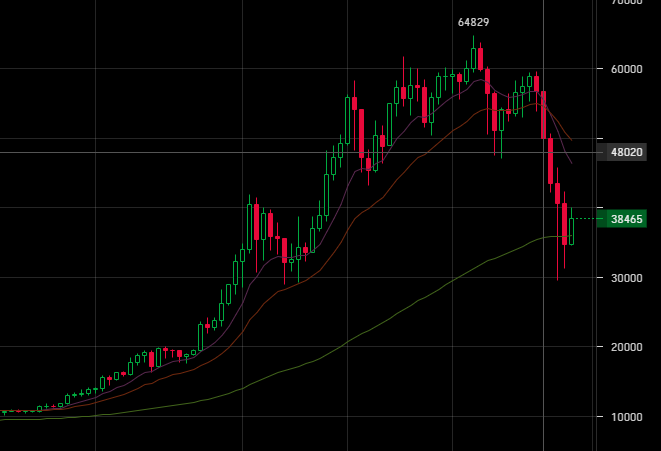

# 2021.05.25 Вторник
## Смена тренда в выход из сделки btc/rur
### Предыстория
[2020.12.16](2020.12.16.md) и [2020.12.17](2021.12.17.md) закинул на биржу YoBit по 15'000 р. Полученные 30'000 р. запустил в каскад btc/rur.  
В календаре поставил напоминалку на 17 мая со следующим текстом:
>2020.12.16-17 закинул на биржу 30 кр.  
>Баланс биржы был 22'404.  
>Можно забрать всё что выше этой суммы.

Состояние торгов на паре btc/usd 3D на бирже Bitfinex выглядит так:  

Даю скриншот с cryptowatch, т.к. на спекуляторе нет трёхдневных свечей

В общем тренд сменился и пошёл обвал, клиенты бирж начали выпрыгивать из окон.

В общем предполагаю два варианта действий:
 - произойдёт отскок до 48'000 - 51'000 usd/btc, затем следуем линии тренда вниз  
 Средний период роста 6 свечек, т.е. 18 дней. Минимальный период 4 свечки - 12 дней
 - батонимся примерно на этом уровне, без красивых отскоков, затем летим в пропасть

Можно дождаться приемлемых условий и продать крипту
При снижении цены меньше цены закрытия вчерашнего дня, можно будет или продать крипту и запустить новые каскады или дождаться полного входа каскадов в сделку, убить каскады и перелить полученную крипту в ботов.

Обдумать предложенные варианты и расчитать диапазоны цен.

Линия тренда сменилась, когда очередная линия поддержки оказалась ниже предыдущей. По аналогии можно смотреть линии поддержки для текущего отскока в меньшем временном масштабе. Воспользуюсь H6, лучше-бы, конечно H12, но там не так явно видны эти линии.

Господа кроты, теперь давайте посчитаем:
| |Exmo|YoBit|
|:--|--:|--:|
|**Теория** руб.|50'060.79|72'546.60|
|**Закрыть сегодня** руб.|35'723.17|48'887.83|
|**Закрыть по максимуму** руб.|~45'347.52 [1](#exmo_max)|~63'394.60 [2](#yobit_max)|
|**Закрыть по минимуму** руб.|~32'205.84 [3](#exmo_min)|~42'919.60 [4](#yobit_min)|

<<<<<<< HEAD
выручка 59'414  (0.01619 @ 3'677'204)  
на балансе 2'307  
на ордерах 650
=======
Стратегия получается такая: каждые 4 часа смотрим график H6 BTC/RUR на YoBit. В случае снижения уровня поддержки ниже предыдущей, и получения выхлопа более 63'000 р., производим принудителное закрытие сделки. 

В противном случае выходим в режим скупердяя. Запоминаем цену профита, а полученный биткоин переводим в самостоятельные торги.

За курсом следим максимум в течение 21 дня. Ели курс будет колебаться без особых трендов - доплнительные измышления спустя две недели.

А пробой линии поддержки стоит использовать в будующих торгах.  
Формула для получения профита:
`481.8 * 2 + 1825 + 0.01638 * 3.7e6`

[exmo max](#exmo_max) предполагаемый курс 3'500'000 руб/btc  
[yobit max](#yobit_max) предполагаемый курс 3'700'000 руб/btc

[exmo min](#exmo_min) предполагаемый курс 2'300'000 руб/btc  
[yobit min](#yobit_min) предполагаемый курс 2'450'000 руб/btc
>>>>>>> c69b95a483f03cce4a7b6a3c560640c72958b803
