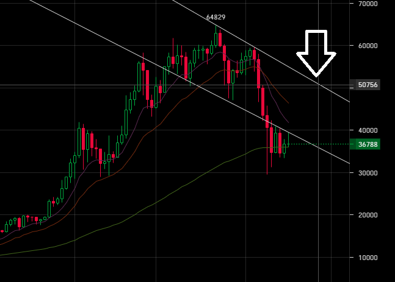

# 2021.06.04 Пятница
## Оределение стратегии дальнейших действий.
Внёс данные по доходам ботов за май месяц.

Можно сделать привычный, но парадоксальный вывод: у меня не получается вручную управлять денежным потоком. Нужно доверяться алгоритму.  
Каскад BTC/RUR на бирже YoBit вошёл в сделку 2021.4.16, а на EXMO продержался до 2021.5.12.

Причём, совокупный доход за апрель месяц составил $190, а за май: $159. Т.е. падение дохода есть, но не катастрофическое. Сейчас доход приносят пары eth/btc.

Попытался сделать прогноз на 3D графике биржы bitfinex. У меня несть шанс до 23 июня получить курс в 50000 usd/btc. По такой цене я могу принудительно закрыть ботов с приемлимыми потерями.

Если до 23 июня курс не достигнет приемлимых значений, я отменяю ботов, запоминаю профитный курс, а полученные btc перевожу ботам eth/btc. Пусть они доход приносят.
Спустя неведомое мне время, при достижении курсом провитной цены, возвращаю нужное кол-во btc "взад" и продолжаю активно использовать ботов btc/rur, которые до этого момента работали на остатках.

Надеюсь, что этот план действий я смогу выполнить.