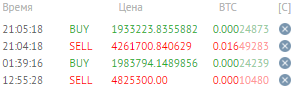

# 2021.06.04 Пятница
## Исполнение каскада на eth/btc на Yobit
Имеем следующую ситуацию: на бирже Yobit исполнился каскад ETH/BTC.  
Баланс биржы:   0.04559452 BTC  
Баланс каскада: 0.04552811 BTC  
Норм.

Рассмотрим каскад паре BTC/RUR:  

Желаемая цена реализации: 4'261'700 руб/бтц  
Текущая цена: 2'530'000 руб/бтц

Объём каскада: 71'307.6 rur  

Перевожу **0.0165936 btc** в каскад eth/btc. Рублёвый каскад запускаю на оставшихся средствах.

Касскад ETH/BTC запускаю на 0.0621881 btc

0.0455945  
0.0165936  
0.0621881 

Когда стоимость биткоина превысит 4'261'700 руб. Возвращаю **0.0165936** в каскад btc/rur. Можно будет вернуть 30 кр. обрано на банковский счёт.

Получилось 0.0165977

## Исполнение каскада на eth/btc на EXMO

Баланс бота:  0.07433867 btc  
Баланс биржы: 0.0743959 btc  
Норм

Состояние каскада BTC/RUR  
Желаемая цена реализации: 3'887'365 руб/бтц  
Желаемый объём реализации: 0.01266423 btc
Общий объём инвестиций: 49196.39 rur

Перевожу **0.01266423 btc** в каскад eth/btc. Рублёвый каскад запускаю на оставшихся средствах.

Получилось 0.08706013 btc и 1214.06 р

Когда стоимость биткоина превысит 3'887'365 руб. Возвращаю **0.01266423 btc** в каскад btc/rur.

